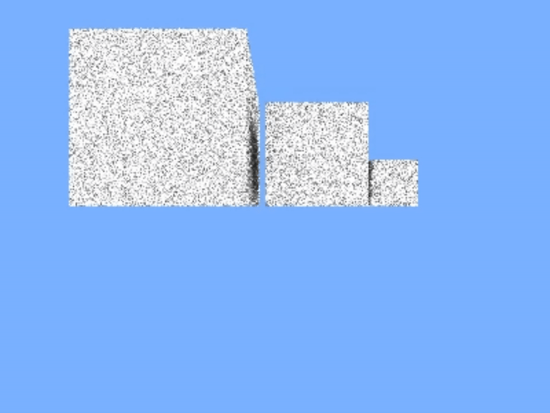
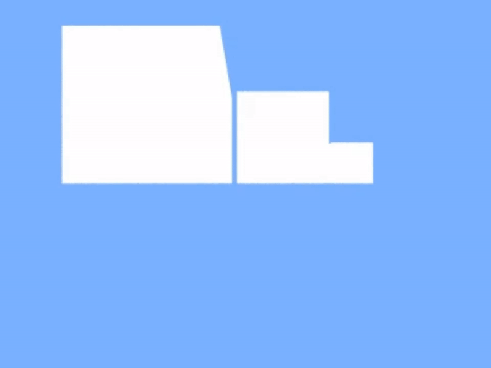

# LightSim3D

## Table of Contents
- [Overview](#overview)
- [Features](#features)
- [Demo](#demo)
- [Installation](#installation)
- [Usage Instructions](#usage-instructions)

## Overview
**LightSim3D** implements a complete rendering pipeline to load OBJ files, build an efficient BVH (Bounding Volume Hierarchy) for acceleration, and perform real-time path tracing using CUDA. The project features physically based rendering (PBR), direct light sampling, and interactive controls—all integrated with OpenGL for display.

## Features
- GPU-Accelerated Path Tracing: Leverages NVIDIA CUDA for high-performance raytracing.
- BVH Acceleration: Utilizes a bounding volume hierarchy for efficient ray-primitive intersection tests.
- Physically Based Rendering (PBR): Supports materials with adjustable albedo, metallicity, and emission.
- Direct Light Sampling: Employs next-event estimation to compute direct lighting without duplication of effort.
- OBJ File Importing: Loads complex 3D scenes using [TinyObjLoader](https://github.com/tinyobjloader/tinyobjloader/blob/release/tiny_obj_loader.h).
- Interactive Controls:
    - Camera Movement: Use W/A/S/D keys to move, Space/Left Shift for vertical movement.
    - Mouse Rotation: Rotate the scene with the mouse. Press Escape to unlock the cursor and Left Mouse Button to re-lock.
- Rendering Effects: Switch between different material effects (e.g., metal, matte, default) via command-line arguments.
- Environment Lighting: Includes an encompassing environment sphere for realistic global illumination.

## Demo
The demos below showcase a single scene composed of [`three cubes`](assets/mul_cubes.obj) rendered with different material effects, though users are free to render any objects of their choice. Notice how the matte rendering effectively mimics shadowing from occlusions, while the metallic surface is purely specular and fully reflects the environment lighting.

| **Matte Rendering Effect** | **Metallic Rendering Effect** |
|----------------------------|-------------------------------|
|  |  |

## Installation
- Prerequisites
    - CUDA Toolkit: Ensure you have a CUDA-compatible NVIDIA GPU with the appropriate CUDA toolkit installed.
    - OpenGL Libraries: Updated drivers and libraries to support OpenGL rendering.  
    - GLEW & GLFW: Required for context creation and window management. 
    - C++ Compiler: Supporting C++11 or later. 
    - Make: The project uses a Makefile for building in a Windows environment. Note: You may need to adjust local paths, particularly those related to the device compiler (nvcc), the host C++ compiler, and the CUDA Toolkit installation.
- Build 
  - Clone the repository:
    ```bash
    git clone https://github.com/ron-che-debugger/LightSim3D.git
    cd LightSim3D
    ```
  - Then simply run:
    ```bash
    make
    ```
  - (Optional) Use precompiled executable:  
    If you prefer not to build from source, you can use the provided [`executable`](bin/raytracer.exe) in a Windows environment.

## Usage Instructions
- Pre-rendering asset preparation
    - **LightSim3D**  employs global emission rendering—through its environment sphere—to deliver realistic lighting. To ensure accurate light contribution, all object faces must be outward-oriented. 
    The provided [`fix_obj_normals.py`](utils/fix_obj_normals.py) script pre-processes your OBJ files by: 
      - Computing the object centroid.
      - Determining face normals using fan triangulation.  
      - Flipping inward-facing faces to align with global emission sources.  
    Usage:
        ```bash
        python fix_obj_normals.py input.obj output.obj
        ```
- Launch raytracer 
    - Launch with the required OBJ file path. Optionally, specify the window resolution and desired material effect:  
        ```bash
        ./raytracer path/to/model.obj <width> <height> <effect>
        ```
        - width and height: Set the window resolution (default is 800x600). 
        - effect: Choose the rendering effect—options include:
            - metal: Fully metallic surfaces for a shiny appearance.  
            - matte: Purely diffuse surfaces with high roughness for a chalky look.  
            - not specified(default): A balanced material leaning toward metallic. 

## License
This project is licensed under the MIT License. See the [`LICENSE`](LICENSE) file for details.